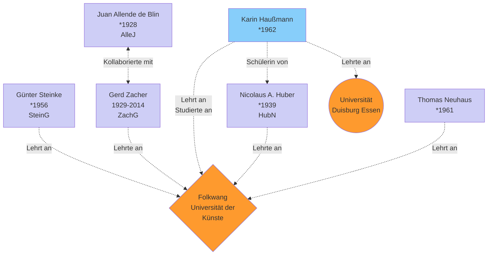
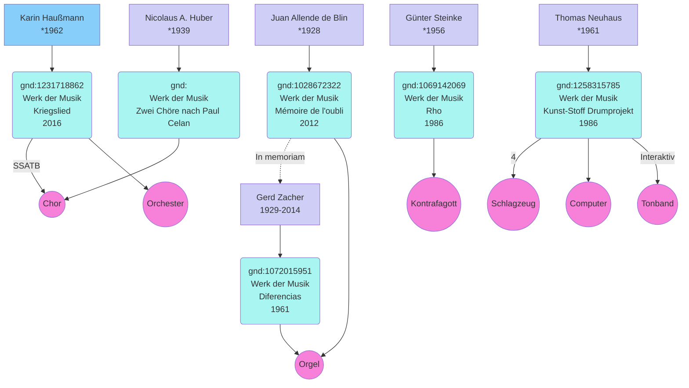

### Kollaboration, Affiliation

```mermaid
flowchart TD
classDef Werk fill:#A9F5F2;
classDef Person_w fill:#87CEFA;
classDef Ort fill:#A9A9F5;
classDef Sammlung fill:#F781D8;
classDef Person_m fill:#CECEF6;
classDef Institution fill:#FE9A2E;
a_de-blin[Juan Allende de Blin<br>*1928<br>AlleJ]:::Person_m;
g_steinke[Günter Steinke<br>*1956<br>SteinG]:::Person_m;
th_neuhaus[Thomas Neuhaus<br>*1961]:::Person_m;
g_zacher[Gerd Zacher<br>1929-2014<br>ZachG]:::Person_m;
k_haussmann[Karin Haußmann<br>*1962]:::Person_w;
na_huber[Nicolaus A. Huber<br>*1939<br>HubN]:::Person_m;

Folkwang{Folkwang <br>Universität der<br> Künste}:::Institution
UDE((Universität<br>Duisburg Essen)):::Institution

a_de-blin <-.->|Kollaborierte mit| g_zacher
g_steinke -.->|Lehrt an| Folkwang
g_zacher -.->|Lehrte an| Folkwang
k_haussmann -.->|Lehrt an<br>Studierte an| Folkwang
k_haussmann -.->|Lehrte an| UDE
k_haussmann -.->|Schülerin von| na_huber
na_huber -.->|Lehrte an| Folkwang
th_neuhaus -.->|Lehrt an| Folkwang
```

### Schaffen

```mermaid
flowchart
classDef Werk fill:#A9F5F2;
classDef Person_w fill:#87CEFA;
classDef Ort fill:#A9A9F5;
classDef Besetzung fill:#F781D8;
classDef Person_m fill:#CECEF6;
classDef Institution fill:#FE9A2E;
a_de-blin[Juan Allende de Blin<br>*1928]:::Person_m;
g_steinke[Günter Steinke<br>*1956]:::Person_m;
th_neuhaus[Thomas Neuhaus<br>*1961]:::Person_m;
g_zacher[Gerd Zacher<br>1929-2014]:::Person_m;
k_haussmann[Karin Haußmann<br>*1962]:::Person_w;
na_huber[Nicolaus A. Huber<br>*1939]:::Person_m;

deblin_2012_memoire(gnd:1028672322<br>Werk der Musik<br>Mémoire de l'oubli<br>2012):::Werk -.->|In memoriam| g_zacher
neuhaus_1989_kunststoff(gnd:1258315785<br>Werk der Musik<br>Kunst-Stoff Drumprojekt<br>1986):::Werk
haussmann_2016_kriegslied(gnd:1231718862<br>Werk der Musik<br>Kriegslied<br>2016):::Werk
steinke_1986_rho(gnd:1069142069<br>Werk der Musik<br>Rho<br>1986):::Werk
zacher_1961_diferencias(gnd:1072015951<br>Werk der Musik<br>Diferencias<br>1961):::Werk
huber_1965_choerecelan(gnd:<br>Werk der Musik<br>Zwei Chöre nach Paul Celan):::Werk

Besetzung_Chor((Chor)):::Besetzung
Besetzung_Orchester((Orchester)):::Besetzung
Besetzung_Kontrafagott((Kontrafagott)):::Besetzung
Besetzung_Orgel((Orgel)):::Besetzung
Besetzung_Schlagzeug((Schlagzeug)):::Besetzung
Besetzung_Tonband((Tonband)):::Besetzung
Besetzung_Computer((Computer)):::Besetzung

a_de-blin -->deblin_2012_memoire --> Besetzung_Orgel
g_steinke --> steinke_1986_rho --> Besetzung_Kontrafagott
g_zacher --> zacher_1961_diferencias --> Besetzung_Orgel
th_neuhaus -->neuhaus_1989_kunststoff
	neuhaus_1989_kunststoff -->|4| Besetzung_Schlagzeug((Schlagzeug)):::Besetzung
	neuhaus_1989_kunststoff --> Besetzung_Computer((Computer)):::Besetzung
	neuhaus_1989_kunststoff -->|Interaktiv| Besetzung_Tonband((Tonband)):::Besetzung
k_haussmann --> haussmann_2016_kriegslied
	haussmann_2016_kriegslied -->|SSATB| Besetzung_Chor
	haussmann_2016_kriegslied --> Besetzung_Orchester 
na_huber --> huber_1965_choerecelan --> Besetzung_Chor
```

